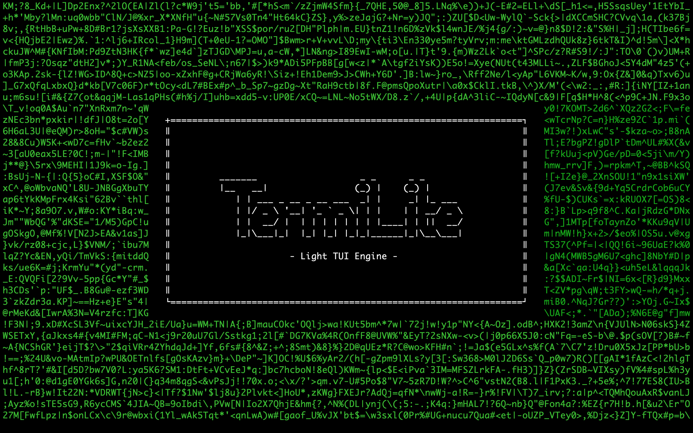

<p align="center">
    
</p>

A lightweight TUI engine designed in Python. Obviously, it isn't exactly done, but I plan to use it on various projects. So as time goes, future projects may require more stuff from this small library, and, overtime, the library will grow.

As of now, it has no dependencies, and works in any system. There is proper Z-indexing, windows, labels, buttons, input boxes, ANSI escape sequence parsing, and I plan to add the 'etc.' part later.

# Syntax

```py
Window(
    x: int,
    y: int,
    z: int,
    width: int,
    height: int,
    name: str,
    color: str,
    margin_top: int,
    margin_bottom: int,
    margin_left: int,
    margin_right: int,
)

Window.is_draggable: bool = True

Window.resizable_top: bool    = True
Window.resizable_bottom: bool = True
Window.resizable_left: bool   = True
Window.resizable_right: bool  = True

Window.border_top: str      = termilite.globals.HLINE
Window.border_bottom: str   = termilite.globals.HLINE
Window.border_left: str     = termilite.globals.VLINE
Window.border_right: str    = termilite.globals.VLINE
Window.focussed_top: str    = '='
Window.focussed_bottom: str = '='

Window.top_left_corner: str     = termilite.globals.CORNER_TOP_LEFT
Window.top_right_corner: str    = termilite.globals.CORNER_TOP_RIGHT
Window.bottom_left_corner: str  = termilite.globals.CORNER_BOTTOM_LEFT
Window.bottom_right_corner: str = termilite.globals.CORNER_BOTTOM_RIGHT

Window.focussable: str = True
```

```py
Panel( # Subclass of Window, works similarly
    side: str,
    size: int,
    z: int,
    resizable: bool = True,
    name: str = ""
)
```

```py
Label(
    window: Window,
    x: int, y: int,
    text: str,
    width: int = None, # Self adjusts to take requires space
    height: int = None,
    color: str # Use termilite.color
)
```

```py
InputBox(
    window: Window,
    x: int,
    y: int,
    width: int = None, # Assumes parent window size
    height: int = None,
    maxlen: int = 10
)

InputBox.value: str = ""
InputBox.underline: str = "_"
InputBox.cursor: str = "|"
```

```py
Button(
    window: Window,
    x: int,
    y: int,
    text: str,
    width: int,
    height: int,
    onclick: lambda: None
)
```

---

*Distributed under the MIT License. See [LICENSE](LICENSE) for more information.*
